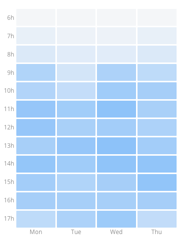
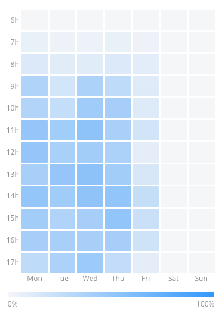

# Task description

Your task is to create simple component/components to display given data in grid form shown below.

## Component specification

Component will display heatmap of occupancy data in grid form where columns represents days in week and rows prepresents hours. Each field will display occupancy by its color intensity. Datasets have random amount of days and hours but in dataset amount of hours is always same for every day. Occupancy is represented in percentage from 0 to 100%.

## Data format

You will get data from `DataService` with method `loadData(dataSet?: number)` where you can input numbers 1 to 6 for different data sets (stored in /assets). Returned data will look like this:

```json
{
  "buckets": [
    <Day>{
      "key": 4,
      "doc_count": 432,
      "histogram": {
        "buckets": [
          <Hour>{
            "key_as_string": "13:00:00",
            "key": 39600000,
            "doc_count": 108,
            "data": {
              "value": 42.31175925925926
            }
          },
        ...
        ]
      }
    }
    ...
  ]
}
```

First layer of bucket contains array of days where property `key` represents day in week 1 - monday, 2 - tuesday and so on. Each day has property `histogram` where second layer of buckets represents array of hours of that day, property `key_as_string` represents that hour and `data` holds value in occupancy percentage.

## Nice to have

- Display only columns/rows for days/rows returned in payload, do not display empty fields

- Use component only to display data. Data parsing should be separate from view components.

- Create UI selector for datasets

## Expected results





## Project info

This project was generated with [Angular CLI](https://github.com/angular/angular-cli) version 9.0.3.

### Development server

Run `ng serve` for a dev server. Navigate to `http://localhost:4200/`. The app will automatically reload if you change any of the source files.

### Code scaffolding

Run `ng generate component component-name` to generate a new component. You can also use `ng generate directive|pipe|service|class|guard|interface|enum|module`.

### Build

Run `ng build` to build the project. The build artifacts will be stored in the `dist/` directory. Use the `--prod` flag for a production build.

### Further help

To get more help on the Angular CLI use `ng help` or go check out the [Angular CLI README](https://github.com/angular/angular-cli/blob/master/README.md).
